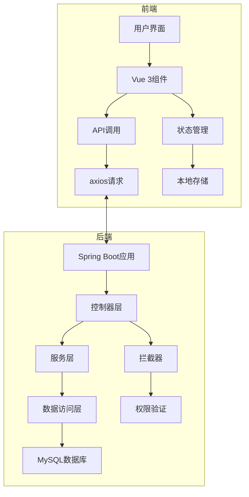
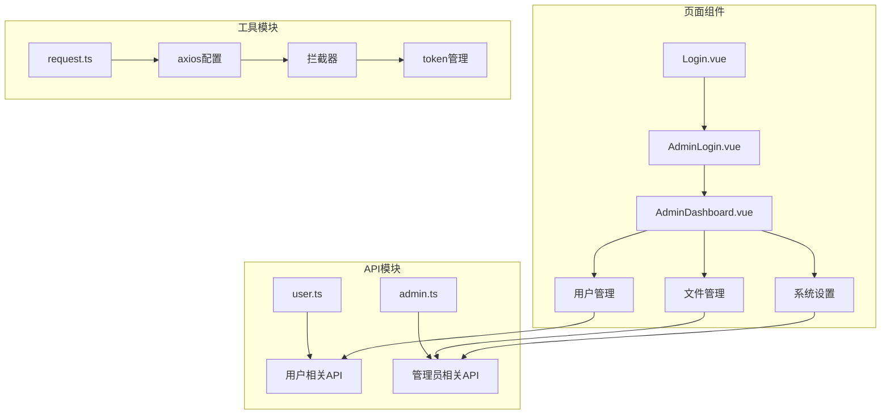
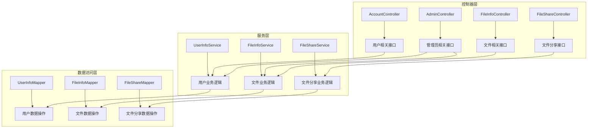
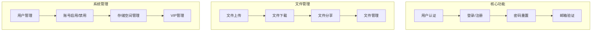

# Easy云盘项目架构
## 系统架构


## 前端架构



## 后端架构



## 功能模块



## 技术栈

| 分类 | 技术 | 版本 |
|------|------|------|
| 前端 | Vue 3 | 3.x |
| 前端 | TypeScript | 4.x+ |
| 前端 | Element Plus | 2.x |
| 前端 | Axios | 1.x |
| 后端 | Spring Boot | 3.x |
| 后端 | MyBatis-Plus | 3.x |
| 后端 | MySQL | 8.x |
| 后端 | Redis | 7.x |

## 项目启动流程

### 前端启动
1. **进入前端目录**：
   ```bash
   cd easypan-frontend
   ```
2. **安装依赖**（首次运行）：
   ```bash
   npm install
   ```
3. **启动开发服务器**：
   ```bash
   npm run dev
   ```
4. **访问前端**：
   - 打开浏览器，访问终端输出的本地地址（通常是 `http://localhost:5173`）

### 后端启动
#### 方法1：使用IDEA启动
1. 打开 `easypan-backend` 目录
2. 找到 `EasyPanApplication.java` 启动类
3. 右键点击并选择 "Run EasyPanApplication"

#### 方法2：使用Maven启动
1. **进入后端目录**：
   ```bash
   cd easypan-backend
   ```
2. **启动应用**：
   ```bash
   mvn spring-boot:run
   ```
3. **访问后端API**：
   - 后端服务默认运行在 `http://localhost:8080`

## 环境要求
- **前端**：Node.js 16.x+
- **后端**：JDK 17+, Maven 3.8+
- **数据库**：MySQL 8.x
- **缓存**：Redis 7.x


## 项目运行截图
登录界面

成功登录

进入首页

文件类型进具体分类-部分显示

文件分享-创建分享

文件分享-复制分享链接(可进行直接下载或保存至网盘)

文件删除后移至回收站-可进行恢复或彻底粉碎

会员中心-设有三个套餐(可进行按需购买-充值通过支付宝沙箱支付实现)充值成功显示vip会员标识

登录页-分享中心

登录页-管理员账号登录

管理员后台页面-仪表盘

管理员后台页面-用户管理-显示具体用户信息(可进行账号的启用和禁用/修改账号网盘空间)

管理员后台页面-文件管理-可查看所有账号网盘内的文件

管理员后台页面-系统设置-可修改所有用户基础网盘空间


