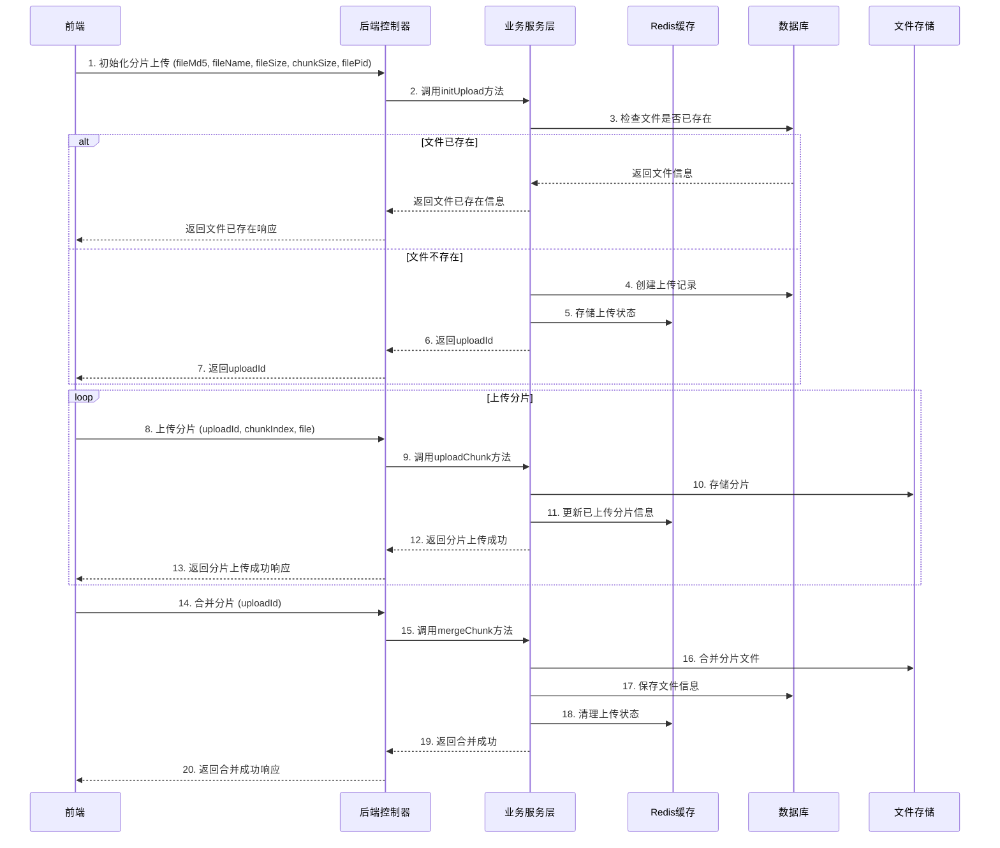
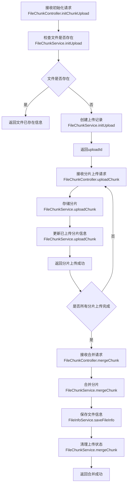
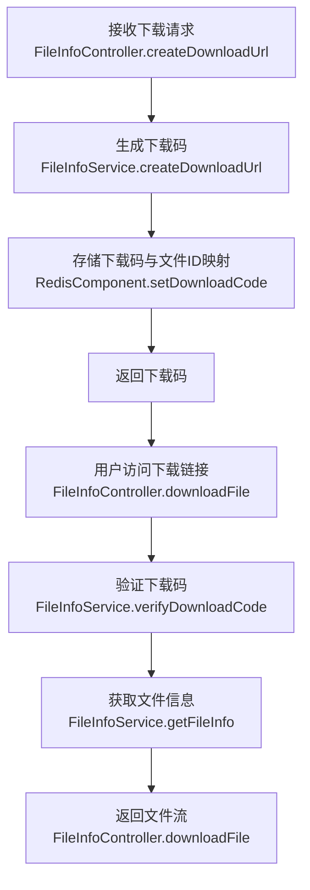
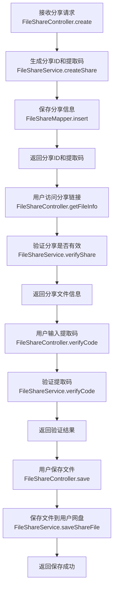

# 1. 仓库分析

## 1.1 前端仓库分析

通过对前端仓库的分析，我们可以看到这是一个基于 Vue 3 + TypeScript + Element Plus 构建的云盘前端应用。主要功能包括：

- **文件管理**：支持文件的上传、下载、创建文件夹、重命名、删除、移动等操作
- **文件分享**：支持创建文件分享链接，设置提取码和过期时间
- **回收站**：支持文件的恢复和永久删除
- **会员中心**：支持用户升级会员，获取更大的存储空间
- **用户管理**：支持用户登录、注册、修改密码等操作

### 前端技术栈

| 技术 | 版本 | 用途 |
|------|------|------|
| Vue | ^3.3.0 | 前端框架 |
| TypeScript | ^5.2.0 | 类型系统 |
| Element Plus | ^2.13.6 | UI 组件库 |
| Axios | ^1.6.0 | HTTP 客户端 |
| Pinia | ^2.1.0 | 状态管理 |
| Vue Router | ^4.2.0 | 路由管理 |
| Spark MD5 | ^3.0.2 | 文件 MD5 计算 |

### 前端文件上传实现

前端文件上传采用分片上传的方式，具体流程如下：

1. **文件选择**：用户通过文件选择框或拖拽方式选择文件
2. **MD5 计算**：使用 SparkMD5 计算文件的 MD5 值，用于文件唯一性校验
3. **初始化上传**：调用 `/file/chunk/init` 接口，获取上传 ID
4. **分片上传**：将文件分成多个分片，并发上传到服务器
5. **合并分片**：所有分片上传完成后，调用 `/file/chunk/merge` 接口合并分片

前端上传相关代码位于：
- `src/api/file.ts`：文件上传相关 API 调用
- `src/views/FileManager.vue`：文件管理器组件，包含上传逻辑

## 1.2 后端仓库分析

后端仓库是一个基于 Spring Boot 构建的 Java 应用，主要功能包括：

- **文件管理**：处理文件的上传、下载、管理等操作
- **用户管理**：处理用户的登录、注册、信息管理等操作
- **文件分享**：处理文件分享的创建、校验、保存等操作
- **会员管理**：处理会员的升级、订单管理等操作
- **系统配置**：处理系统的配置信息

### 后端技术栈

| 技术 | 版本 | 用途 |
|------|------|------|
| Java | 1.8+ | 开发语言 |
| Spring Boot | 2.x | 应用框架 |
| MyBatis-Plus | 3.x | ORM 框架 |
| Redis | 6.x | 缓存 |
| MySQL | 5.7+ | 数据库 |
| Maven | 3.x | 构建工具 |

### 后端文件上传实现

后端文件上传采用分片上传的方式，具体流程如下：

1. **初始化上传**：接收前端的初始化请求，创建上传记录，返回上传 ID
2. **接收分片**：接收前端上传的分片，存储到临时目录
3. **合并分片**：接收前端的合并请求，将所有分片合并成完整文件
4. **保存文件信息**：将文件信息保存到数据库

后端上传相关代码位于：
- `com.easypan.controller.FileChunkController`：分片上传相关接口
- `com.easypan.service.FileChunkService`：分片上传相关服务
- `com.easypan.service.FileInfoService`：文件信息相关服务

## 1.3 前端对后端的依赖

前端通过以下 API 与后端交互：

| API 路径 | 方法 | 功能 | 前端调用位置 |
|---------|------|------|------------|
| `/file/loadDataList` | POST | 加载文件列表 | `src/api/file.ts:loadDataList` |
| `/file/createFolder` | POST | 创建文件夹 | `src/api/file.ts:createFolder` |
| `/file/rename` | POST | 重命名文件 | `src/api/file.ts:renameFile` |
| `/file/delete` | POST | 删除文件 | `src/api/file.ts:deleteFile` |
| `/file/move` | POST | 移动文件 | `src/api/file.ts:moveFile` |
| `/file/recycle/list` | POST | 获取回收站列表 | `src/api/file.ts:getRecycleList` |
| `/file/recycle/recover` | POST | 恢复文件 | `src/api/file.ts:recoverFile` |
| `/file/recycle/delete` | POST | 永久删除文件 | `src/api/file.ts:permanentDelete` |
| `/file/createDownloadUrl` | POST | 创建下载链接 | `src/api/file.ts:createDownloadUrl` |
| `/file/share/create` | POST | 创建分享 | `src/api/file.ts:createShare` |
| `/file/share/list` | POST | 获取分享列表 | `src/api/file.ts:getShareList` |
| `/file/share/cancel` | POST | 取消分享 | `src/api/file.ts:cancelShare` |
| `/file/share/verifyCode` | POST | 校验分享提取码 | `src/api/file.ts:verifyShareCode` |
| `/file/share/getFileInfo` | GET | 获取分享文件信息 | `src/api/file.ts:getShareFileInfo` |
| `/file/share/save` | POST | 保存分享文件 | `src/api/file.ts:saveShareFile` |
| `/file/chunk/init` | POST | 初始化分片上传 | `src/api/file.ts:initChunkUpload` |
| `/file/chunk/upload` | POST | 上传分片 | `src/api/file.ts:uploadChunk` |
| `/file/chunk/merge` | POST | 合并分片 | `src/api/file.ts:mergeChunk` |
| `/file/chunk/getUploadedChunks` | GET | 查询已上传分片 | `src/api/file.ts:getUploadedChunks` |
| `/user/login` | POST | 用户登录 | `src/api/user.ts:login` |
| `/user/register` | POST | 用户注册 | `src/api/user.ts:register` |
| `/user/getUseSpace` | POST | 获取用户空间使用情况 | `src/api/user.ts:getUseSpace` |
| `/user/logout` | POST | 用户退出 | `src/api/user.ts:logout` |
| `/vip/list` | POST | 获取会员套餐列表 | `src/api/vip.ts:getVipList` |
| `/vip/order/create` | POST | 创建会员订单 | `src/api/vip.ts:createVipOrder` |

# 2. 后端系统技术方案

## 2.1. 技术选型

| 分类 | 技术 | 版本 | 选型理由 |
| :--- | :--- | :--- | :--- |
| 语言 | Java | 1.8+ | 编译型语言，性能优异，生态成熟，适合高并发后端服务。 |
| 框架 | Spring Boot | 2.7.15 | 快速构建 RESTful API，内置Tomcat容器，简化配置，提供丰富的生态组件。 |
| 数据库 | MySQL | 5.7+ | 关系型数据库，稳定可靠，适合存储结构化数据，与Spring Boot集成良好。 |
| 缓存 | Redis | 6.0+ | 用于缓存热点数据、管理用户会话、存储临时上传状态，提高系统响应速度。 |
| ORM | MyBatis-Plus | 3.5.3.1 | 简化MyBatis操作，提供代码生成器，支持Lambda表达式，提高开发效率。 |
| 认证 | JWT | - | 无状态认证，便于水平扩展，适合前后端分离架构。 |
| 构建工具 | Maven | 3.8.8 | 项目管理工具，依赖管理，构建打包，与Spring Boot集成良好。 |

## 2.2. 关键设计

### 2.2.1. 架构设计
- **架构风格**: 集成式单体应用 (Integrated Monolith)。后端逻辑作为独立模块，与前端通过API交互。
- **模块划分**:
  - `controller`: 处理HTTP请求，参数校验，返回响应
  - `service`: 业务逻辑层，处理核心业务逻辑
  - `mapper`: 数据访问层，与数据库交互
  - `entity`: 实体类，包含PO、DTO、VO等
  - `utils`: 工具类
  - `redis`: Redis操作相关
  - `exception`: 异常处理
  - `annotation`: 自定义注解

- **核心流程图**:



### 2.2.2. 目录结构

```plaintext
/src
  /main
    /java/com/easypan
      /annotation        # 自定义注解
      /controller        # 控制器
      /entity            # 实体类
        /config          # 配置类
        /constants       # 常量
        /dto             # 数据传输对象
        /enums           # 枚举类
        /po              # 持久化对象
        /query           # 查询对象
        /vo              # 视图对象
      /exception         # 异常处理
      /mappers           # 数据访问层
      /redis             # Redis操作
      /service           # 业务逻辑层
        /impl            # 业务逻辑实现
      /task              # 定时任务
      /utils             # 工具类
      /CodeGenerator.java # 代码生成器
      /EasyPanApplication.java # 应用入口
    /resources
      /mappers           # MyBatis映射文件
      /static            # 静态资源
      /application.yml   # 应用配置
      /easypan.sql       # 数据库脚本
      /logback-spring.xml # 日志配置
  /test
    /java/com/easypan    # 测试代码
```

* 说明：
  * `controller/`（新增）：处理HTTP请求，参数校验，返回响应
  * `service/`（新增）：业务逻辑层，处理核心业务逻辑
  * `mappers/`（新增）：数据访问层，与数据库交互
  * `entity/`（新增）：实体类，包含PO、DTO、VO等
  * `utils/`（新增）：工具类
  * `redis/`（新增）：Redis操作相关
  * `exception/`（新增）：异常处理
  * `annotation/`（新增）：自定义注解

### 2.2.3. 关键类与函数设计

| 类/函数名 | 说明 | 参数（类型/含义） | 成功返回结构/类型 | 失败返回结构/类型 | 所属文件/模块 | 溯源 |
|---------|------|-----------------|-----------------|-----------------|------------|------|
| `FileChunkController.initChunkUpload` | 初始化分片上传 | fileMd5: String 文件MD5<br>fileName: String 文件名<br>fileSize: Long 文件大小<br>chunkSize: Integer 分片大小<br>filePid: String 父文件夹ID<br>token: String 用户token | `ResponseVO{code=200, status="success", info="", data=uploadId}` | `ResponseVO{code=500, status="error", info="错误信息", data=null}` | `controller/FileChunkController.java` | `src/api/file.ts:initChunkUpload` |
| `FileChunkController.uploadChunk` | 上传分片 | uploadId: String 上传ID<br>chunkIndex: Integer 分片索引<br>file: MultipartFile 分片文件<br>token: String 用户token | `ResponseVO{code=200, status="success", info="", data="分片上传成功"}` | `ResponseVO{code=500, status="error", info="错误信息", data=null}` | `controller/FileChunkController.java` | `src/api/file.ts:uploadChunk` |
| `FileChunkController.mergeChunk` | 合并分片 | uploadId: String 上传ID<br>token: String 用户token | `ResponseVO{code=200, status="success", info="", data="文件合并成功"}` | `ResponseVO{code=500, status="error", info="错误信息", data=null}` | `controller/FileChunkController.java` | `src/api/file.ts:mergeChunk` |
| `FileChunkController.getUploadedChunks` | 查询已上传分片 | uploadId: String 上传ID<br>token: String 用户token | `ResponseVO{code=200, status="success", info="", data=[0,1,2,...]}` | `ResponseVO{code=500, status="error", info="错误信息", data=null}` | `controller/FileChunkController.java` | `src/api/file.ts:getUploadedChunks` |
| `FileInfoController.loadDataList` | 加载文件列表 | filePid: String 父文件夹ID<br>category: String 文件分类<br>fileName: String 文件名<br>pageNo: Integer 页码<br>pageSize: Integer 每页大小 | `ResponseVO{code=200, status="success", info="", data={total, pageSize, pageNo, pageTotal, records}}` | `ResponseVO{code=500, status="error", info="错误信息", data=null}` | `controller/FileInfoController.java` | `src/api/file.ts:loadDataList` |
| `FileInfoController.createFolder` | 创建文件夹 | filePid: String 父文件夹ID<br>folderName: String 文件夹名称 | `ResponseVO{code=200, status="success", info="", data="文件夹创建成功"}` | `ResponseVO{code=500, status="error", info="错误信息", data=null}` | `controller/FileInfoController.java` | `src/api/file.ts:createFolder` |
| `FileInfoController.rename` | 重命名文件 | fileId: String 文件ID<br>newFileName: String 新文件名 | `ResponseVO{code=200, status="success", info="", data="重命名成功"}` | `ResponseVO{code=500, status="error", info="错误信息", data=null}` | `controller/FileInfoController.java` | `src/api/file.ts:renameFile` |
| `FileInfoController.delete` | 删除文件 | fileId: String 文件ID | `ResponseVO{code=200, status="success", info="", data="删除成功"}` | `ResponseVO{code=500, status="error", info="错误信息", data=null}` | `controller/FileInfoController.java` | `src/api/file.ts:deleteFile` |
| `FileInfoController.move` | 移动文件 | fileId: String 文件ID<br>filePid: String 目标父文件夹ID | `ResponseVO{code=200, status="success", info="", data="移动成功"}` | `ResponseVO{code=500, status="error", info="错误信息", data=null}` | `controller/FileInfoController.java` | `src/api/file.ts:moveFile` |
| `FileInfoController.createDownloadUrl` | 创建下载链接 | fileId: String 文件ID | `ResponseVO{code=200, status="success", info="", data=downloadCode}` | `ResponseVO{code=500, status="error", info="错误信息", data=null}` | `controller/FileInfoController.java` | `src/api/file.ts:createDownloadUrl` |
| `FileShareController.create` | 创建分享 | fileId: String 文件ID<br>expireType: Integer 过期类型 | `ResponseVO{code=200, status="success", info="", data={shareId, shareCode}}` | `ResponseVO{code=500, status="error", info="错误信息", data=null}` | `controller/FileShareController.java` | `src/api/file.ts:createShare` |
| `FileShareController.list` | 获取分享列表 | 无 | `ResponseVO{code=200, status="success", info="", data=[{shareId, fileName, fileSize, expireTime, shareTime, downloadCount}]}` | `ResponseVO{code=500, status="error", info="错误信息", data=null}` | `controller/FileShareController.java` | `src/api/file.ts:getShareList` |
| `FileShareController.cancel` | 取消分享 | shareId: String 分享ID | `ResponseVO{code=200, status="success", info="", data="取消分享成功"}` | `ResponseVO{code=500, status="error", info="错误信息", data=null}` | `controller/FileShareController.java` | `src/api/file.ts:cancelShare` |
| `FileShareController.verifyCode` | 校验分享提取码 | shareId: String 分享ID<br>shareCode: String 提取码 | `ResponseVO{code=200, status="success", info="", data=true}` | `ResponseVO{code=500, status="error", info="错误信息", data=null}` | `controller/FileShareController.java` | `src/api/file.ts:verifyShareCode` |
| `FileShareController.getFileInfo` | 获取分享文件信息 | shareId: String 分享ID | `ResponseVO{code=200, status="success", info="", data={fileId, fileName, fileSize, fileSizeStr, isFolder, shareTime, expireTime}}` | `ResponseVO{code=500, status="error", info="错误信息", data=null}` | `controller/FileShareController.java` | `src/api/file.ts:getShareFileInfo` |
| `FileShareController.save` | 保存分享文件 | shareId: String 分享ID<br>filePid: String 目标父文件夹ID | `ResponseVO{code=200, status="success", info="", data="保存成功"}` | `ResponseVO{code=500, status="error", info="错误信息", data=null}` | `controller/FileShareController.java` | `src/api/file.ts:saveShareFile` |
| `AccountController.login` | 用户登录 | email: String 邮箱<br>password: String 密码 | `ResponseVO{code=200, status="success", info="", data={token, userId, nickName, email, vipLevel}}` | `ResponseVO{code=500, status="error", info="错误信息", data=null}` | `controller/AccountController.java` | `src/api/user.ts:login` |
| `AccountController.register` | 用户注册 | email: String 邮箱<br>password: String 密码<br>nickName: String 昵称<br>code: String 验证码 | `ResponseVO{code=200, status="success", info="", data="注册成功"}` | `ResponseVO{code=500, status="error", info="错误信息", data=null}` | `controller/AccountController.java` | `src/api/user.ts:register` |
| `AccountController.getUseSpace` | 获取用户空间使用情况 | 无 | `ResponseVO{code=200, status="success", info="", data={useSpace, useSpaceStr, totalSpace, totalSpaceStr}}` | `ResponseVO{code=500, status="error", info="错误信息", data=null}` | `controller/AccountController.java` | `src/api/user.ts:getUseSpace` |
| `AccountController.logout` | 用户退出 | 无 | `ResponseVO{code=200, status="success", info="", data="退出成功"}` | `ResponseVO{code=500, status="error", info="错误信息", data=null}` | `controller/AccountController.java` | `src/api/user.ts:logout` |
| `VipController.list` | 获取会员套餐列表 | 无 | `ResponseVO{code=200, status="success", info="", data=[{packageId, packageName, price, originalPrice, description, features}]}` | `ResponseVO{code=500, status="error", info="错误信息", data=null}` | `controller/VipController.java` | `src/api/vip.ts:getVipList` |
| `VipOrderController.create` | 创建会员订单 | packageId: String 套餐ID | `ResponseVO{code=200, status="success", info="", data={orderId, payUrl}}` | `ResponseVO{code=500, status="error", info="错误信息", data=null}` | `controller/VipOrderController.java` | `src/api/vip.ts:createVipOrder` |

### 2.2.4. 数据库与数据结构设计

- **数据库表结构**:

**`user_info`表**
| 字段名 | 数据类型 | 约束 | 描述 |
| :--- | :--- | :--- | :--- |
| `user_id` | `VARCHAR(32)` | `PRIMARY KEY` | 用户ID |
| `email` | `VARCHAR(50)` | `UNIQUE NOT NULL` | 邮箱 |
| `password` | `VARCHAR(32)` | `NOT NULL` | 密码（MD5加密） |
| `nick_name` | `VARCHAR(50)` | `NOT NULL` | 昵称 |
| `avatar` | `VARCHAR(255)` | | 头像路径 |
| `register_time` | `DATETIME` | `NOT NULL` | 注册时间 |
| `last_login_time` | `DATETIME` | | 最后登录时间 |
| `vip_level` | `INT` | `NOT NULL DEFAULT 0` | VIP等级 |
| `vip_expire_time` | `DATETIME` | | VIP过期时间 |
| `use_space` | `BIGINT` | `NOT NULL DEFAULT 0` | 已用空间（字节） |
| `total_space` | `BIGINT` | `NOT NULL DEFAULT 5368709120` | 总空间（字节） |

**`file_info`表**
| 字段名 | 数据类型 | 约束 | 描述 |
| :--- | :--- | :--- | :--- |
| `file_id` | `VARCHAR(32)` | `PRIMARY KEY` | 文件ID |
| `file_pid` | `VARCHAR(32)` | `NOT NULL` | 父文件夹ID |
| `file_name` | `VARCHAR(255)` | `NOT NULL` | 文件名 |
| `file_suffix` | `VARCHAR(10)` | | 文件后缀 |
| `file_size` | `BIGINT` | `NOT NULL DEFAULT 0` | 文件大小（字节） |
| `file_path` | `VARCHAR(255)` | | 文件路径 |
| `is_folder` | `INT` | `NOT NULL DEFAULT 0` | 是否为文件夹（0-文件，1-文件夹） |
| `user_id` | `VARCHAR(32)` | `NOT NULL` | 用户ID |
| `create_time` | `DATETIME` | `NOT NULL` | 创建时间 |
| `last_op_time` | `DATETIME` | `NOT NULL` | 最后操作时间 |
| `delete_flag` | `INT` | `NOT NULL DEFAULT 0` | 删除标志（0-正常，1-已删除） |
| `file_md5` | `VARCHAR(32)` | | 文件MD5 |

**`file_chunk`表**
| 字段名 | 数据类型 | 约束 | 描述 |
| :--- | :--- | :--- | :--- |
| `chunk_id` | `VARCHAR(32)` | `PRIMARY KEY` | 分片ID |
| `upload_id` | `VARCHAR(32)` | `NOT NULL` | 上传ID |
| `file_md5` | `VARCHAR(32)` | `NOT NULL` | 文件MD5 |
| `chunk_index` | `INT` | `NOT NULL` | 分片索引 |
| `chunk_path` | `VARCHAR(255)` | `NOT NULL` | 分片路径 |
| `user_id` | `VARCHAR(32)` | `NOT NULL` | 用户ID |
| `create_time` | `DATETIME` | `NOT NULL` | 创建时间 |

**`file_share`表**
| 字段名 | 数据类型 | 约束 | 描述 |
| :--- | :--- | :--- | :--- |
| `share_id` | `VARCHAR(32)` | `PRIMARY KEY` | 分享ID |
| `file_id` | `VARCHAR(32)` | `NOT NULL` | 文件ID |
| `user_id` | `VARCHAR(32)` | `NOT NULL` | 分享用户ID |
| `share_code` | `VARCHAR(6)` | `NOT NULL` | 提取码 |
| `expire_time` | `DATETIME` | `NOT NULL` | 过期时间 |
| `share_time` | `DATETIME` | `NOT NULL` | 分享时间 |
| `download_count` | `INT` | `NOT NULL DEFAULT 0` | 下载次数 |
| `status` | `INT` | `NOT NULL DEFAULT 1` | 状态（1-有效，0-无效） |

**`vip_order`表**
| 字段名 | 数据类型 | 约束 | 描述 |
| :--- | :--- | :--- | :--- |
| `order_id` | `VARCHAR(32)` | `PRIMARY KEY` | 订单ID |
| `user_id` | `VARCHAR(32)` | `NOT NULL` | 用户ID |
| `package_id` | `VARCHAR(32)` | `NOT NULL` | 套餐ID |
| `amount` | `DECIMAL(10,2)` | `NOT NULL` | 金额 |
| `order_time` | `DATETIME` | `NOT NULL` | 订单时间 |
| `pay_time` | `DATETIME` | | 支付时间 |
| `status` | `INT` | `NOT NULL DEFAULT 0` | 状态（0-待支付，1-已支付，2-已取消） |

**`sys_config`表**
| 字段名 | 数据类型 | 约束 | 描述 |
| :--- | :--- | :--- | :--- |
| `config_key` | `VARCHAR(50)` | `PRIMARY KEY` | 配置键 |
| `config_value` | `VARCHAR(255)` | `NOT NULL` | 配置值 |
| `create_time` | `DATETIME` | `NOT NULL` | 创建时间 |
| `update_time` | `DATETIME` | `NOT NULL` | 更新时间 |

- **数据传输对象 (DTOs)**:

```java
// 登录请求DTO
public class LoginDTO {
    private String email;
    private String password;
}

// 注册请求DTO
public class RegisterDTO {
    private String email;
    private String password;
    private String nickName;
    private String code;
}

// 文件列表查询DTO
public class FileListQueryDTO {
    private String filePid;
    private String category;
    private String fileName;
    private Integer pageNo;
    private Integer pageSize;
}

// 创建文件夹DTO
public class FileCreateFolderDTO {
    private String filePid;
    private String folderName;
}

// 文件重命名DTO
public class FileRenameDTO {
    private String fileId;
    private String newFileName;
}

// 文件移动DTO
public class FileMoveDTO {
    private String fileId;
    private String filePid;
}

// 分片上传初始化DTO
public class FileChunkInitDTO {
    private String fileMd5;
    private String fileName;
    private Long fileSize;
    private Integer chunkSize;
    private String filePid;
}

// 分享创建DTO
public class FileShareCreateDTO {
    private String fileId;
    private Integer expireType;
}

// 分享保存DTO
public class FileShareSaveDTO {
    private String shareId;
    private String filePid;
}

// 会员订单创建DTO
public class VipOrderCreateDTO {
    private String packageId;
}
```

- **视图对象 (VOs)**:

```java
// 统一响应VO
public class ResponseVO {
    private String status;
    private Integer code;
    private String info;
    private Object data;
}

// 文件信息VO
public class FileInfoVO {
    private String fileId;
    private String filePid;
    private String fileName;
    private String fileSuffix;
    private Long fileSize;
    private String fileSizeStr;
    private Integer isFolder;
    private String createTime;
    private String lastOpTime;
    private String userId;
}

// 分页结果VO
public class PaginationResultVO {
    private Integer total;
    private Integer pageSize;
    private Integer pageNo;
    private Integer pageTotal;
    private List<?> records;
}

// 分享信息VO
public class FileShareVO {
    private String shareId;
    private String fileName;
    private Long fileSize;
    private String fileSizeStr;
    private String expireTime;
    private String shareTime;
    private Integer downloadCount;
}

// 会员套餐VO
public class VipPackageVO {
    private String packageId;
    private String packageName;
    private BigDecimal price;
    private BigDecimal originalPrice;
    private String description;
    private List<String> features;
}

// 会员状态VO
public class VipStatusVO {
    private Integer vipLevel;
    private String expireTime;
    private String status;
}

// 用户空间使用情况VO
public class UserSpaceVO {
    private Long useSpace;
    private String useSpaceStr;
    private Long totalSpace;
    private String totalSpaceStr;
}
```

- **枚举类**:

```java
// 响应码枚举
public enum ResponseCodeEnum {
    SUCCESS(200, "success"),
    ERROR(500, "error"),
    PARAM_ERROR(400, "参数错误"),
    UNAUTHORIZED(401, "未授权"),
    FORBIDDEN(403, "禁止访问"),
    NOT_FOUND(404, "资源不存在");
    
    private Integer code;
    private String message;
}

// 文件状态枚举
public enum FileStatusEnum {
    NORMAL(0, "正常"),
    DELETED(1, "已删除");
    
    private Integer code;
    private String message;
}

// 用户VIP等级枚举
public enum UserVipLevelEnum {
    NORMAL(0, "普通用户"),
    VIP(1, "VIP用户");
    
    private Integer code;
    private String message;
}

// VIP套餐枚举
public enum VipPackageEnum {
    MONTHLY("1", "月卡", BigDecimal.valueOf(19.9), BigDecimal.valueOf(29.9)),
    QUARTERLY("2", "季卡", BigDecimal.valueOf(49.9), BigDecimal.valueOf(69.9)),
    YEARLY("3", "年卡", BigDecimal.valueOf(199.9), BigDecimal.valueOf(299.9));
    
    private String packageId;
    private String packageName;
    private BigDecimal price;
    private BigDecimal originalPrice;
}
```

### 2.2.4. API 接口设计

| API路径 | 方法 | 模块/文件 | 类型 | 功能描述 | 请求体 (JSON) | 成功响应 (200 OK) |
| :--- | :--- | :--- | :--- | :--- | :--- | :--- |
| `/api/user/login` | `POST` | `AccountController` | `Router` | 用户登录 | `{"email": "user@example.com", "password": "123456"}` | `{"code": 200, "status": "success", "info": "", "data": {"token": "...", "userId": "...", "nickName": "...", "email": "...", "vipLevel": 0}}` |
| `/api/user/register` | `POST` | `AccountController` | `Router` | 用户注册 | `{"email": "user@example.com", "password": "123456", "nickName": "用户", "code": "123456"}` | `{"code": 200, "status": "success", "info": "", "data": "注册成功"}` |
| `/api/user/getUseSpace` | `POST` | `AccountController` | `Router` | 获取用户空间使用情况 | N/A | `{"code": 200, "status": "success", "info": "", "data": {"useSpace": 1048576, "useSpaceStr": "1MB", "totalSpace": 5368709120, "totalSpaceStr": "5GB"}}` |
| `/api/user/logout` | `POST` | `AccountController` | `Router` | 用户退出 | N/A | `{"code": 200, "status": "success", "info": "", "data": "退出成功"}` |
| `/api/file/loadDataList` | `POST` | `FileInfoController` | `Router` | 加载文件列表 | `{"filePid": "0", "category": "all", "fileName": "", "pageNo": 1, "pageSize": 15}` | `{"code": 200, "status": "success", "info": "", "data": {"total": 10, "pageSize": 15, "pageNo": 1, "pageTotal": 1, "records": [...]}}` |
| `/api/file/createFolder` | `POST` | `FileInfoController` | `Router` | 创建文件夹 | `{"filePid": "0", "folderName": "新建文件夹"}` | `{"code": 200, "status": "success", "info": "", "data": "文件夹创建成功"}` |
| `/api/file/rename` | `POST` | `FileInfoController` | `Router` | 重命名文件 | `{"fileId": "...", "newFileName": "新文件名"}` | `{"code": 200, "status": "success", "info": "", "data": "重命名成功"}` |
| `/api/file/delete` | `POST` | `FileInfoController` | `Router` | 删除文件 | `{"fileId": "..."}` | `{"code": 200, "status": "success", "info": "", "data": "删除成功"}` |
| `/api/file/move` | `POST` | `FileInfoController` | `Router` | 移动文件 | `{"fileId": "...", "filePid": "..."}` | `{"code": 200, "status": "success", "info": "", "data": "移动成功"}` |
| `/api/file/recycle/list` | `POST` | `FileInfoController` | `Router` | 获取回收站列表 | `{"pageNo": 1, "pageSize": 15}` | `{"code": 200, "status": "success", "info": "", "data": {"total": 5, "pageSize": 15, "pageNo": 1, "pageTotal": 1, "records": [...]}}` |
| `/api/file/recycle/recover` | `POST` | `FileInfoController` | `Router` | 恢复文件 | `{"fileId": "..."}` | `{"code": 200, "status": "success", "info": "", "data": "恢复成功"}` |
| `/api/file/recycle/delete` | `POST` | `FileInfoController` | `Router` | 永久删除文件 | `{"fileId": "..."}` | `{"code": 200, "status": "success", "info": "", "data": "删除成功"}` |
| `/api/file/createDownloadUrl` | `POST` | `FileInfoController` | `Router` | 创建下载链接 | `{"fileId": "..."}` | `{"code": 200, "status": "success", "info": "", "data": "downloadCode"}` |
| `/api/file/downloadFile/{code}` | `GET` | `FileInfoController` | `Router` | 下载文件 | N/A | 文件流 |
| `/api/file/chunk/init` | `POST` | `FileChunkController` | `Router` | 初始化分片上传 | `{"fileMd5": "...", "fileName": "...", "fileSize": 1048576, "chunkSize": 1048576, "filePid": "0"}` | `{"code": 200, "status": "success", "info": "", "data": "uploadId"}` |
| `/api/file/chunk/upload` | `POST` | `FileChunkController` | `Router` | 上传分片 | FormData: `uploadId`, `chunkIndex`, `file` | `{"code": 200, "status": "success", "info": "", "data": "分片上传成功"}` |
| `/api/file/chunk/merge` | `POST` | `FileChunkController` | `Router` | 合并分片 | `{"uploadId": "..."}` | `{"code": 200, "status": "success", "info": "", "data": "文件合并成功"}` |
| `/api/file/chunk/getUploadedChunks` | `GET` | `FileChunkController` | `Router` | 查询已上传分片 | `?uploadId=...` | `{"code": 200, "status": "success", "info": "", "data": [0, 1, 2]}` |
| `/api/file/share/create` | `POST` | `FileShareController` | `Router` | 创建分享 | `{"fileId": "...", "expireType": 1}` | `{"code": 200, "status": "success", "info": "", "data": {"shareId": "...", "shareCode": "..."}}` |
| `/api/file/share/list` | `POST` | `FileShareController` | `Router` | 获取分享列表 | N/A | `{"code": 200, "status": "success", "info": "", "data": [...]}` |
| `/api/file/share/cancel` | `POST` | `FileShareController` | `Router` | 取消分享 | `{"shareId": "..."}` | `{"code": 200, "status": "success", "info": "", "data": "取消分享成功"}` |
| `/api/file/share/verifyCode` | `POST` | `FileShareController` | `Router` | 校验分享提取码 | `{"shareId": "...", "shareCode": "..."}` | `{"code": 200, "status": "success", "info": "", "data": true}` |
| `/api/file/share/getFileInfo` | `GET` | `FileShareController` | `Router` | 获取分享文件信息 | `?shareId=...` | `{"code": 200, "status": "success", "info": "", "data": {...}}` |
| `/api/file/share/save` | `POST` | `FileShareController` | `Router` | 保存分享文件 | `{"shareId": "...", "filePid": "..."}` | `{"code": 200, "status": "success", "info": "", "data": "保存成功"}` |
| `/api/vip/list` | `POST` | `VipController` | `Router` | 获取会员套餐列表 | N/A | `{"code": 200, "status": "success", "info": "", "data": [...]}` |
| `/api/vip/order/create` | `POST` | `VipOrderController` | `Router` | 创建会员订单 | `{"packageId": "1"}` | `{"code": 200, "status": "success", "info": "", "data": {"orderId": "...", "payUrl": "..."}}` |
| `/api/vip/order/payCallback` | `POST` | `VipOrderController` | `Router` | 支付回调 | 支付宝回调参数 | `{"code": 200, "status": "success", "info": "", "data": "success"}` |

### 2.2.5. 主业务流程与调用链

#### 文件上传流程



调用链：
- `FileChunkController.initChunkUpload` → `FileChunkService.initUpload` → `FileInfoService.checkFileExist` → `FileChunkMapper.insert`
- `FileChunkController.uploadChunk` → `FileChunkService.uploadChunk` → `FileChunkMapper.insert`
- `FileChunkController.mergeChunk` → `FileChunkService.mergeChunk` → `FileInfoService.saveFileInfo` → `FileChunkMapper.deleteByUploadId`

#### 文件下载流程



调用链：
- `FileInfoController.createDownloadUrl` → `FileInfoService.createDownloadUrl` → `RedisComponent.setDownloadCode`
- `FileInfoController.downloadFile` → `FileInfoService.verifyDownloadCode` → `FileInfoService.getFileInfo`

#### 文件分享流程



调用链：
- `FileShareController.create` → `FileShareService.createShare` → `FileShareMapper.insert`
- `FileShareController.getFileInfo` → `FileShareService.verifyShare` → `FileShareMapper.selectById`
- `FileShareController.verifyCode` → `FileShareService.verifyCode` → `FileShareMapper.selectById`
- `FileShareController.save` → `FileShareService.saveShareFile` → `FileInfoService.saveFileInfo`

## 3. 部署与集成方案

### 3.1. 依赖与环境

| 依赖 | 版本/范围 | 用途 | 安装命令 | 所属文件/配置 |
| :--- | :--- | :--- | :--- | :--- |
| `spring-boot-starter-web` | `2.7.15` | Web 应用支持 | `maven` | `pom.xml` |
| `spring-boot-starter-data-redis` | `2.7.15` | Redis 支持 | `maven` | `pom.xml` |
| `mybatis-plus-boot-starter` | `3.5.3.1` | MyBatis-Plus 支持 | `maven` | `pom.xml` |
| `mysql-connector-java` | `8.0.30` | MySQL 驱动 | `maven` | `pom.xml` |
| `spring-boot-starter-mail` | `2.7.15` | 邮件发送支持 | `maven` | `pom.xml` |
| `hutool-all` | `5.8.18` | 工具类库 | `maven` | `pom.xml` |
| `commons-io` | `2.11.0` | IO 工具类 | `maven` | `pom.xml` |
| `commons-lang3` | `3.12.0` | 语言工具类 | `maven` | `pom.xml` |
| `jjwt` | `0.9.1` | JWT 工具 | `maven` | `pom.xml` |
| `spring-boot-starter-test` | `2.7.15` | 测试支持 | `maven` | `pom.xml` |

### 3.3. 集成与启动方案
- **配置文件 (`application.yml`)**:

```yaml
# 应用服务配置
server:
  port: 7090                                    # WEB访问端口
  servlet:
    context-path: /api                          # 上下文路径
    session:
      timeout: 3600s                            # session过期时间（1小时）
  mvc:
    favicon:
      enabled: false                            # 关闭favicon图标
    throw-exception-if-no-handler-found: true   # 无处理器时抛出异常
  web:
    resources:
      add-mappings: false                       # 关闭静态资源映射

# 数据库配置（HikariCP连接池）
spring:
  datasource:
    url: jdbc:mysql://127.0.0.1:3306/easypan?serverTimezone=GMT%2B8&useUnicode=true&characterEncoding=utf8&autoReconnect=true&allowMultiQueries=true&useSSL=false
    username: root
    password: 123456
    driver-class-name: com.mysql.cj.jdbc.Driver
    hikari:
      pool-name: HikariCPDatasource
      minimum-idle: 5                           # 最小空闲连接数
      idle-timeout: 180000                      # 空闲连接超时时间（3分钟，单位：毫秒）
      maximum-pool-size: 10                     # 最大连接数
      auto-commit: true                         # 自动提交
      max-lifetime: 1800000                     # 连接最大生命周期（30分钟）
      connection-timeout: 30000                 # 连接超时时间（30秒）
      connection-test-query: SELECT 1           # 连接测试SQL

  # 邮件发送配置（QQ邮箱）
  mail:
    host: smtp.qq.com                           # 邮件服务器地址
    port: 465                                   # SSL端口
    username: 2822867926@qq.com                 # 邮箱账号
    password: wuykydvwfvbndgga                  # 邮箱授权码
    default-encoding: UTF-8                     # 默认编码
    properties:
      mail:
        smtp:
          auth: true                            # 开启SMTP认证
          starttls:
            enable: true                        # 启用TLS加密
            required: true
          socketFactory:
            class: javax.net.ssl.SSLSocketFactory  # SSL连接
            fallback: false                     # 禁用SocketFactory降级
        debug: true                             # 开启调试日志

  # Redis配置
  redis:
    database: 0                                 # 数据库索引
    host: 127.0.0.1                             # 地址
    port: 6379                                  # 端口
    password: ""                                # Redis密码（无密码为空）
    jedis:
      pool:
        max-active: 20                          # 最大活跃连接数
        max-wait: -1ms                          # 最大等待时间
        max-idle: 10                            # 最大空闲连接数
        min-idle: 0                             # 最小空闲连接数
    timeout: 2000ms                             # 连接超时时间

  # 文件上传配置
  servlet:
    multipart:
      max-file-size: 10GB      # 单文件最大大小（VIP用户）
      max-request-size: 10GB   # 请求最大大小

easypan:
  file:
    base-path: E:/Workspace-java/easypan/esay-backend/file        # 文件存储根路径
  avatar:
    base-path: E:/Workspace-java/easypan/esay-backend/avatar      # 头像存储路径
  redis:
    expire:
      download-code: 3600      # 下载码有效期（1小时）
      share-code: 86400        # 分享码有效期（24小时）

# MyBatis-Plus 配置
mybatis-plus:
  type-aliases-package: com.easypan.entity.po
  mapper-locations: classpath:mappers/**/*.xml
  configuration:
    map-underscore-to-camel-case: true
    log-impl: org.apache.ibatis.logging.stdout.StdOutImpl  # 开发环境开启SQL日志
  global-config:
    db-config:
      id-type: ASSIGN_UUID
      table-prefix: ""

# 项目自定义配置
project:
  folder: E:/Workspace-java/easypan/esay-backend/            # 项目根路径

# 日志配置
logging:
  level:
    root: INFO
    org.springframework: WARN
    com.zaxxer.hikari: WARN
    org.redisson: WARN
    com.easypan: DEBUG                          # 项目包日志级别
  pattern:
    console: "%d{yyyy-MM-dd HH:mm:ss} [%level][%logger{50}][%method][%line]-> %msg%n"

# 系统配置
admin:
  emails: 2822867926@qq.com                     # 超级管理员邮箱

dev: false                                      # 是否为开发环境

# QQ登录相关配置
qq:
  oauth:
    client-id: 101xxxxxx        # QQ登录AppID（需替换为真实值）
    client-secret: a1b2c3d4e5f6g7h8i9j0  # QQ登录AppKey（需替换为真实值）
    redirect-uri: http://localhost:7090/api/qqlogin/callback  # 回调地址
    authorize-url: https://graph.qq.com/oauth2.0/authorize
    token-url: https://graph.qq.com/oauth2.0/token
    user-info-url: https://graph.qq.com/user/get_user_info

# VIP相关配置
vip:
  normal:
    maxFileSize: 5368709120 # 普通用户最大文件5GB（字节）
    chunkSize: 104857600    # 普通用户分片100MB（字节）
  vip:
    maxFileSize: 107374182400 # VIP用户最大文件100GB（字节）
    chunkSize: 524288000      # VIP用户分片500MB（字节）
```

- **启动命令**:

```bash
# 开发环境启动
mvn spring-boot:run

# 生产环境构建
mvn clean package -DskipTests

# 生产环境启动
java -jar easypan-backend.jar
```

### 4. 代码安全性

#### 4.1. 注意事项
1. **SQL注入**：使用MyBatis-Plus的参数化查询，避免直接拼接SQL语句
2. **XSS攻击**：对用户输入进行过滤和转义
3. **CSRF攻击**：使用JWT token进行身份验证，避免使用cookie
4. **文件上传安全**：对上传文件进行类型检查，限制上传文件大小，使用安全的文件存储路径
5. **密码安全**：对用户密码进行MD5加密存储
6. **权限控制**：对API接口进行权限验证，确保用户只能访问自己的资源
7. **敏感信息泄露**：避免在日志中记录敏感信息，使用环境变量或配置文件存储敏感配置
8. **DDoS攻击**：对API接口进行限流，防止恶意请求

#### 4.2. 解决方案
1. **SQL注入防护**：
   - 使用MyBatis-Plus的Lambda表达式和QueryWrapper进行查询
   - 避免使用@Select注解直接拼接SQL

2. **XSS攻击防护**：
   - 使用HtmlUtils对用户输入进行转义
   - 在前端使用Element Plus的表单验证

3. **CSRF攻击防护**：
   - 使用JWT token进行身份验证
   - 在请求头中传递token，不使用cookie

4. **文件上传安全**：
   - 对上传文件进行类型检查，只允许指定类型的文件
   - 限制上传文件大小，根据用户VIP等级设置不同的限制
   - 使用安全的文件存储路径，避免直接存储在web根目录
   - 对上传文件进行MD5校验，防止重复上传

5. **密码安全**：
   - 对用户密码进行MD5加密存储
   - 在登录时对密码进行MD5加密后再与数据库中的密码进行比较

6. **权限控制**：
   - 使用自定义注解@GlobalInterceptor进行权限验证
   - 在Service层进行业务逻辑的权限检查，确保用户只能访问自己的资源

7. **敏感信息保护**：
   - 在日志中屏蔽敏感信息，如密码、token等
   - 使用环境变量或配置文件存储敏感配置，如数据库密码、邮箱授权码等

8. **DDoS攻击防护**：
   - 使用Redis进行API接口限流
   - 在nginx层面配置限流策略
   - 对恶意请求进行拦截和封禁

9. **数据备份**：
   - 定期对数据库进行备份
   - 对文件存储进行备份，防止数据丢失

10. **安全审计**：
    - 记录用户的关键操作日志
    - 定期进行安全审计，发现并修复安全漏洞